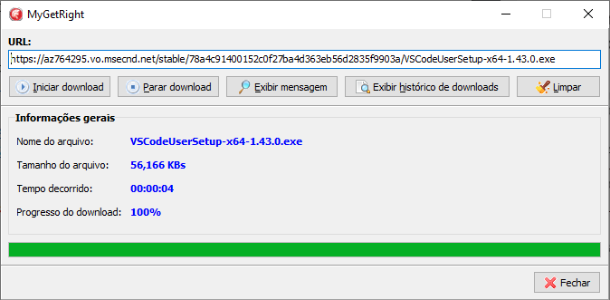

<h1 align="center">
    
MyGetRight

    
</h1>

## Índice
- [Sobre](#-sobre)
- [Feramentas](#-ferramentas)
- [Funcionalidades](#-funcionalidades)
- [Licença](#-licença)

## 📘 Sobre

**Prova Delphi MP**, onde consiste basicamente  apresentar uma pequena aplicação que permita realizar o download de arquivos da internet.

## 🛠 Ferramentas

- [Delphi XE7](https://www.embarcadero.com/br/)
- [SQLite](https://www.sqlite.org/index.html)
- [SQLite Studio](https://sqlitestudio.pl/)
- [Git](https://git-scm.com/)
- [Tortoise Git](https://tortoisegit.org/)
- [Visual Studio Code](https://code.visualstudio.com/)

## 💡 Funcionalidades

- **Iniciar download**: Tendo preenchido corretamente o campo **Url**, ao clicar, o usuário terá a opção de salvar o arquivo em disco com o nome que desejar. Quando começar o download, o painel de **Informações gerais** será exibido, informando o **Nome do arquivo**, **Tamanho do arquivo**, **Tempo decorrido** e **Progresso do download**.

- **Parar download**: Uma vez iniciado o download, ao clicar nesse botão, o download é interrompido automaticamente.

- **Exibir mensagem**: Uma vez iniciado o download, ao clicar nesse botão, é exibida uma mensagem indicando a porcentagem atual do download.

- **Exibir histórico de download**: Exibe o histórico dos downloads efetuados, sendo informado o **Código**, a **Url**, a **Data de Início** e a **Data final**.

- **Limpar**: Limpa o conteúdo do campo **Url**. O painel de **Informações gerais** ficará oculto.

- **Fechar**: Ao clicar nesse botão, se houver algum download em andamento, o usuário será perguntado se deseja prosseguir, caso sim, o download é interrompido e a aplicação se encerra, caso contrário, o download prossegue normalmente.

## 📄 Licença

Esse software é **free** e foi construído para realizar a **Prova Delphi MP**.